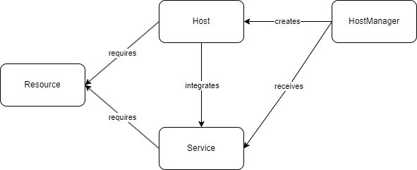

# One Exercise Two Approaches

This repo showcases two approaches to one task, both a python-based approach using dictionaries as well as an object-oriented approach in Java.

## General Task definition

You are given a list of services which require resources. These resources are cpu, network, and ram (for now). You are supposed to create hosts to host these services. Each new host has resources, which are pre-defined as well.

This task does not aim at finding an ideal distribution of services onto the hosts. Rather, simply iterate through all hosts until you find one that can accomodate the current service, or, if such a host does not exist, create a new one.

Finally, return a list of created hosts and the services they host, as well as the remaining host resources.

## Concrete Task shape

The input is given by [to_match.json](to_match.json), and the output is written to [matched.json](matched.json)

## OOP solution design

The diagram below shows the relation of objects in the OOP solution:

